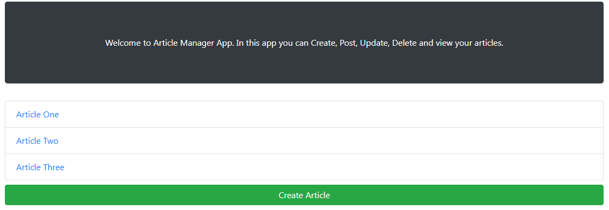
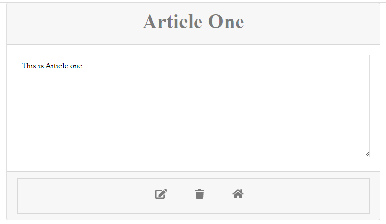

# Article Manager

In this project I built an article manager CRUD app using Express.js where the users of the website can create, update, delete and view articles. The backend storage is simply using array memory for now. This app also uses the express-validator npm package which is an express.js middleware to do a few validations such as making sure that all required fields are filled in and that the password entries match.

Below are snapshots of the project.

#

## Instructions

Install the required dependencies by using the "npm install" command and run "node server.js".

## Usage
This app provides users the ability to create/delete/read/update articles.

## Tests
This app was tested manually.

## Future
Updating the backend storage to MongoDB is a future work item.
